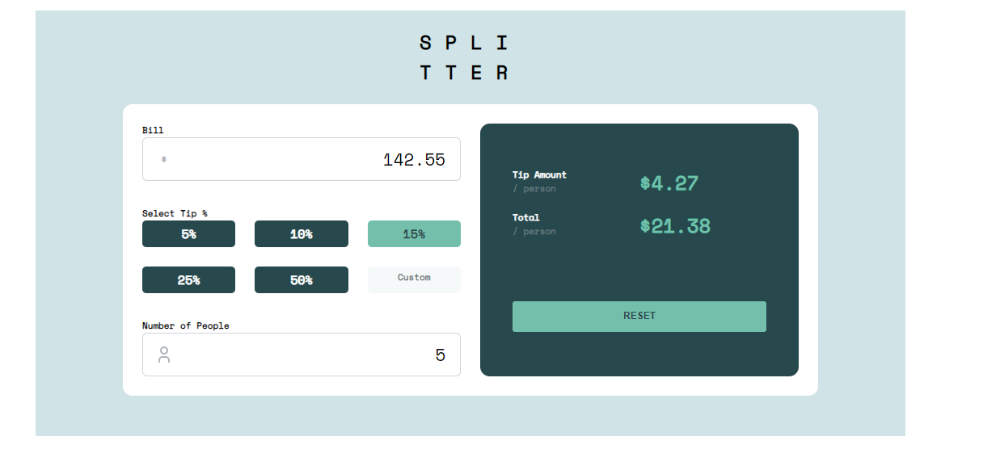
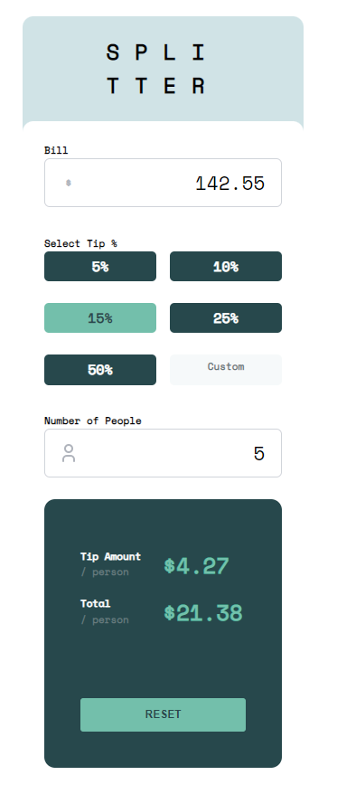

# Frontend Mentor - Tip calculator app solution

This is a solution to the [Tip calculator app challenge on Frontend Mentor](https://www.frontendmentor.io/challenges/tip-calculator-app-ugJNGbJUX). Frontend Mentor challenges help you improve your coding skills by building realistic projects.

## Table of contents

- [Overview](#overview)
  - [The challenge](#the-challenge)
  - [Screenshot](#screenshot)
  - [Links](#links)
- [My process](#my-process)
  - [Built with](#built-with)
  - [What I learned](#what-i-learned)
  - [Continued development](#continued-development)
  - [Useful resources](#useful-resources)
- [Author](#author)
- [Acknowledgments](#acknowledgments)

**Note: Delete this note and update the table of contents based on what sections you keep.**

## Overview

### The challenge

Users should be able to:

- View the optimal layout for the app depending on their device's screen size
- See hover states for all interactive elements on the page
- Calculate the correct tip and total cost of the bill per person

### Screenshot





### Links

- Solution URL: [Github](https://github.com/baskethio/tip-calculator-app)
- Live Site URL: [Add live site URL here](https://baskethio.github.io/tip-calculator-app/)

## My process

I started with basic layout and then I added the functinality and then I continuted to make the UI styling similar to the challenge

### Built with

- CSS Grid
- Mobile-first workflow
- [tablar icons react](https://tabler-icons-react.vercel.app) - Icons library
- [Mantine](https://mantine.dev) - React components libranty
- [React](https://reactjs.org/) - JS library
- [Next.js](https://nextjs.org/) - React framework

### What I learned

I learned how to display and hide content based on changing width and height. I also learned how to truncate numbers without rounding. It also helped me know more Markdown.

### Code I am proud of:

```html
sx={{ borderRadius: "12px", fontSize: "11px", width: "80%", margin: "0 auto",
"@media (max-width: 45rem)": { borderRadius: "12px 12px 0 0 !important", width:
"100%", }, }}
```

```css
.two-cols {
	display: grid;
	grid-template-columns: repeat(2, 1fr);
	margin-top: 15px;
}
```

```js
Math.trunc(tipAmount * 100) / 100;
```

### Continued development

I want to learn more about GraphQL more.

### Useful resources

- [Stackoverflow](https://stackoverflow.com/questions/4187146/truncate-number-to-two-decimal-places-without-rounding) - This helped me for truncating number. I really liked this pattern and will use it going forward.
- [Stackoverflow](https://stackoverflow.com/questions/14494747/how-to-add-images-to-readme-md-on-github) - This is a solution that helped me insert an image to md file. I'd recommend it to anyone still learning this concept.

## Author

- Website - [Daniel Aklog](https://www.ethioden.com)
- Frontend Mentor - [@baskethio](https://www.frontendmentor.io/profile/baskethio)
- Twitter - [@DanielAklog](https://twitter.com/danielaklog)

## Acknowledgments

I want to thank Johann, CTO, Teymi for showing me mantine.
